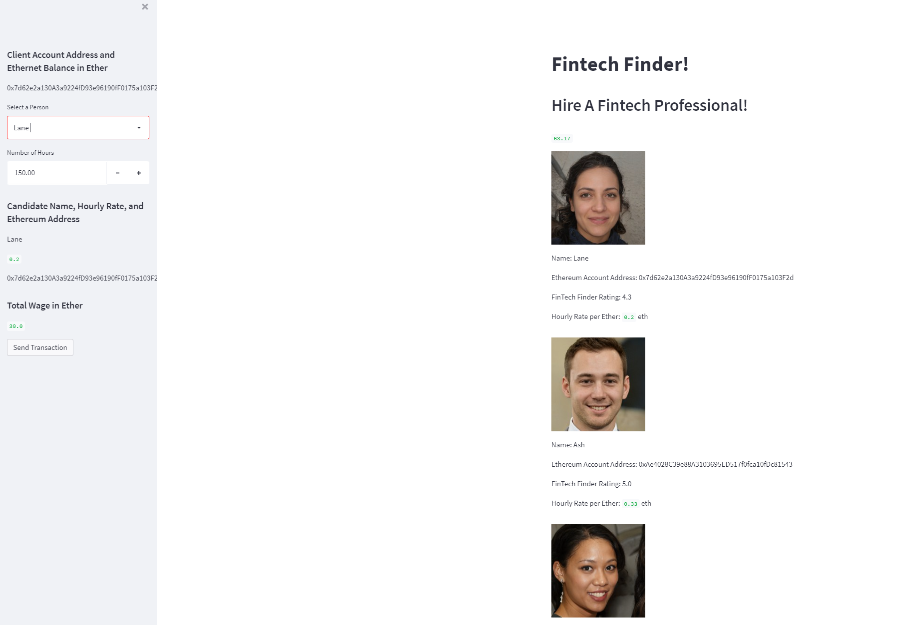
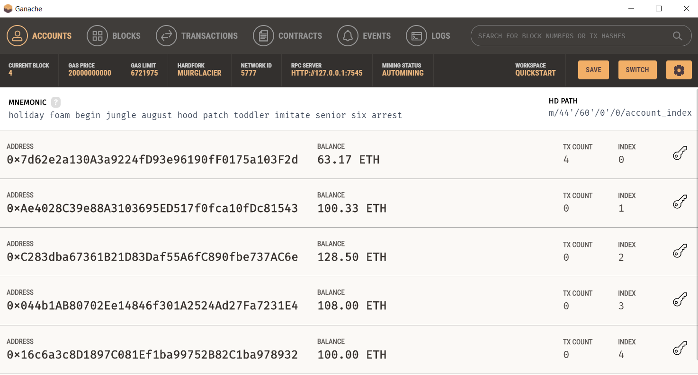
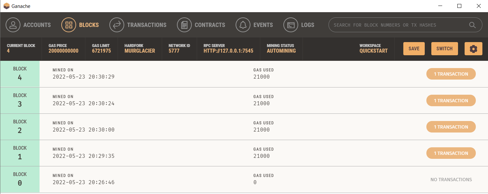
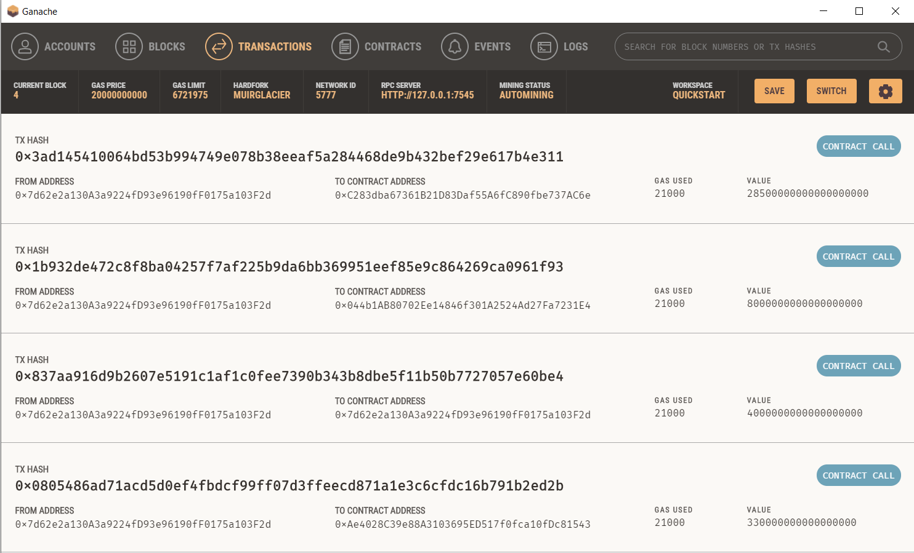

# Fintech-Blockchain-Wallet

## Overview

In this repo is a demonstration of a testnet of transactions utilising ganache and visual studio code.

Libraries used:

 - os
 - requests
 - dotenv
 - bip44 - Wallet
 - web3 - Account
 - web3 - middleware
 - web3.gas_strategies.time_based - medium_gas_price_strategy

 ## Conclusion

### Streamlit Front End  

 

### Account Summary  

 

### Block Data  

 

### Transaction Data  

